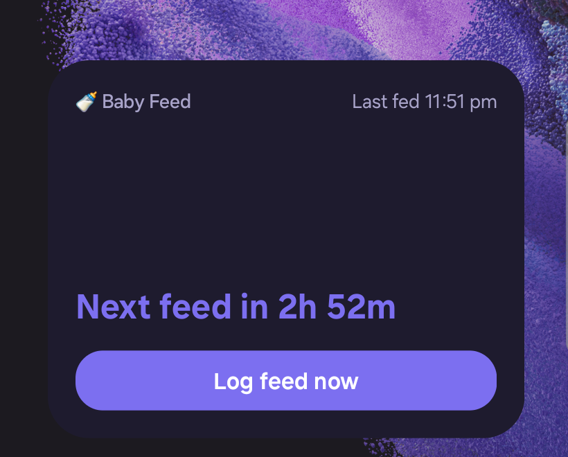
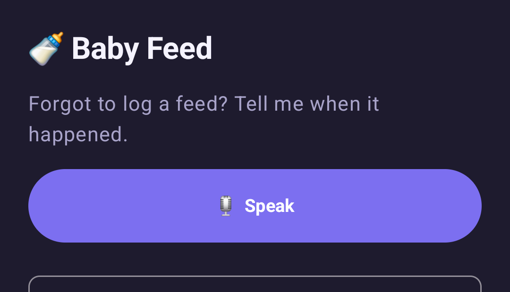
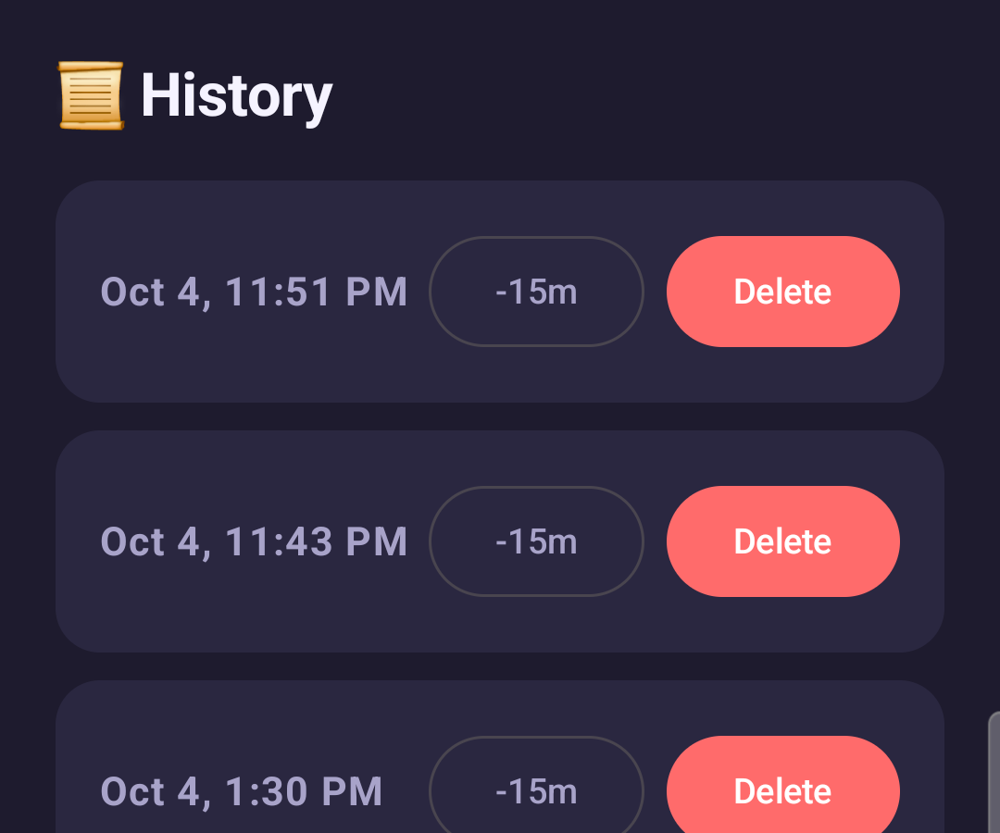
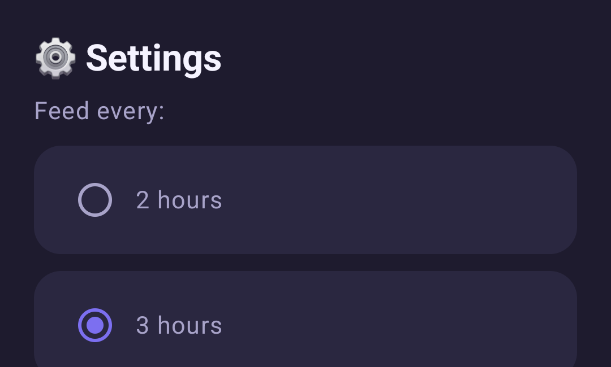

# 🍼 Baby Feed

A home-screen widget for new parents who are too sleep-deprived to open an app and do math.

Built in a weekend for **Hacktoberfest 2026 — "Build for a Friend"** (theme: *open-source AI at its core*), as a gift for a close friend whose newborn arrived a few weeks ago.

<p align="center">
  
</p>

## The problem

My friend was tracking every feed in an Obsidian note. Figuring out "when was she last fed, and when should I feed her next" meant unlocking his phone, opening the app, finding the last entry, and doing the math by hand — real friction at 3am with a newborn.

He needed to log a feed and see the next feeding time from his home screen, without opening anything.

## What it does

- **One-tap logging.** The widget shows last feed time, next feed time, and a live countdown. Tapping "Log feed now" records the current time — no app, no typing.
- **Overdue, not broken.** Once the countdown passes zero, the widget switches to an honest "Overdue by 18m" instead of showing a stale or negative number.
- **Voice/text backdating, for the one time you forget.** Open the app, say or type *"she fed about 20 minutes ago"* or *"fed at 1:30"*, and an on-device model figures out the timestamp. You confirm before it saves.
- **History & settings.** Edit or delete a mistaken entry, and adjust the feeding interval as the baby's schedule changes with age.

## Why open-source AI, specifically

This was built for Hacktoberfest's "open-source AI at its core" theme, and the AI genuinely had to earn its place — not be bolted on for the submission.

Backdating a feed needs to understand phrases like "about 20 minutes ago" or "fed at 1:30" and turn them into an exact timestamp. That's a natural-language problem a simple form can't solve gracefully, and it's exactly where a small open-weight model is a good fit — not a chatbot, not a cloud API, just a narrow extraction task running locally.

- **Everything stays on the phone.** Both speech-to-text and time parsing run entirely on-device — no network call is ever made to log a feed. Nothing about a newborn's feeding schedule leaves a device my friend doesn't fully control.
- **Works at 3am with no signal.** No cloud dependency means no "service unavailable" moment during a feed in the middle of the night.
- **Costs nothing to run.** No API key, no per-request bill, no usage quota — the model runs for free, forever, on hardware he already owns.
- **The model does one honest job.** Rather than asking the LLM to do date arithmetic (which, at 1B parameters, it turned out to be unreliable at — see [below](#a-real-lesson-from-building-this)), it only classifies the input ("RELATIVE 20 MINUTES", "ABSOLUTE 1 30 PM"); Kotlin does the actual subtraction deterministically. The open model is doing what open, inspectable, swappable software is good at: a small, well-scoped job you can reason about and fix when it's wrong.

### A real lesson from building this

The first version asked the model to compute the final timestamp directly (e.g., resolve "20 minutes ago" against the current time itself). On real hardware, Gemma 3 1B reliably understood the phrase but consistently got the subtraction wrong, defaulting to "just now" regardless of few-shot examples or decoding temperature. The fix wasn't a bigger model — it was recognizing that arithmetic belongs in code, not in a language model's forward pass. The model now only extracts structure; `java.time` does the math. It's a small example of why "open" matters here beyond ideology: when something didn't work, the fix was visible and fixable, not a black box to work around.

## Screenshots

<table>
<tr>
<td></td>
<td></td>
<td></td>
</tr>
<tr>
<td align="center">Backdate a feed by voice or text</td>
<td align="center">History — edit or delete entries</td>
<td align="center">Settings — adjust the feeding interval</td>
</tr>
</table>

## How it's built

| Layer | Choice | Why |
|---|---|---|
| Widget | [Jetpack Glance](https://developer.android.com/jetpack/androidx/releases/glance) | A real native home-screen widget, not a web view or notification |
| On-device LLM | [MediaPipe LLM Inference](https://ai.google.dev/edge/mediapipe/solutions/genai/llm_inference) running **Gemma 3 1B (int4, QAT)** | Google's own mobile-tuned open-weight model; runs comfortably on a Snapdragon 8 Gen 2 |
| Speech-to-text | Android's on-device `SpeechRecognizer` (API 31+) | Keeps the "nothing leaves the device" claim true for both steps of backdating, not just the parsing |
| Persistence | [Room](https://developer.android.com/training/data-storage/room) | Local SQLite, no sync, no backend |
| Background refresh | [WorkManager](https://developer.android.com/topic/libraries/architecture/workmanager) | Keeps the countdown fresh between app opens |
| UI | Jetpack Compose + Material3, custom dark theme shared with the widget | One consistent product, not a default-Material app behind a custom widget |

The app is intentionally narrow in scope: feeding only (no diapers/medicine/massage tracking), Android only, single device, no cloud sync, no notifications. See [the original requirements doc](docs/brainstorms/baby-feeding-tracker-widget-requirements.md) for the full reasoning behind every one of those cuts.

## Getting started

**Requirements:** a recent Android Studio, a physical Android device running API 31+ (the on-device `SpeechRecognizer` APIs this app relies on don't exist on the emulator), and a Hugging Face or Kaggle account.

1. **Clone and open the project**
   ```bash
   git clone https://github.com/nish17/baby-feed.git
   cd baby-feed
   ```
   Open it in Android Studio and let it sync.

2. **Download the model** (one-time, ~555MB)

   Gemma models require a free license click-through before download. Grab `gemma3-1b-it-int4.task` from [`litert-community/Gemma3-1B-IT`](https://huggingface.co/litert-community/Gemma3-1B-IT) on Hugging Face (accept the Gemma Terms of Use first).

3. **Push the model to your device**
   ```bash
   adb shell mkdir -p /data/local/tmp/llm
   adb push gemma3-1b-it-int4.task /data/local/tmp/llm/model.task
   ```
   The app looks for the model at exactly that path. If it's missing, backdating silently falls back to a manual time picker instead of crashing — the app is fully usable without ever doing this step, just without AI-assisted backdating.

4. **Build and install**
   ```bash
   ./gradlew installDebug
   ```
   Then long-press your home screen → Widgets → **Baby Feed** to add the widget.

## Testing

- **53 unit tests** — business logic, view models, and the Glance widget composable, run entirely on the JVM (no device needed): `./gradlew testDebugUnitTest`
- **14 instrumented tests** — Room DAO, WorkManager workers, on-device speech recognition, and real on-device LLM inference against the pushed Gemma model: `./gradlew connectedDebugAndroidTest`

## Acknowledgments

Built for [Hacktoberfest 2026](https://hacktoberfest.com/)'s "Build for a Friend" weekend. Thanks to the open-weight model and tooling that made the on-device AI pitch possible: [Gemma 3](https://ai.google.dev/gemma) and [MediaPipe](https://ai.google.dev/edge/mediapipe/solutions/genai/llm_inference) from Google.

And mostly — thanks to the new parents this was actually built for. Congratulations. 🎉
